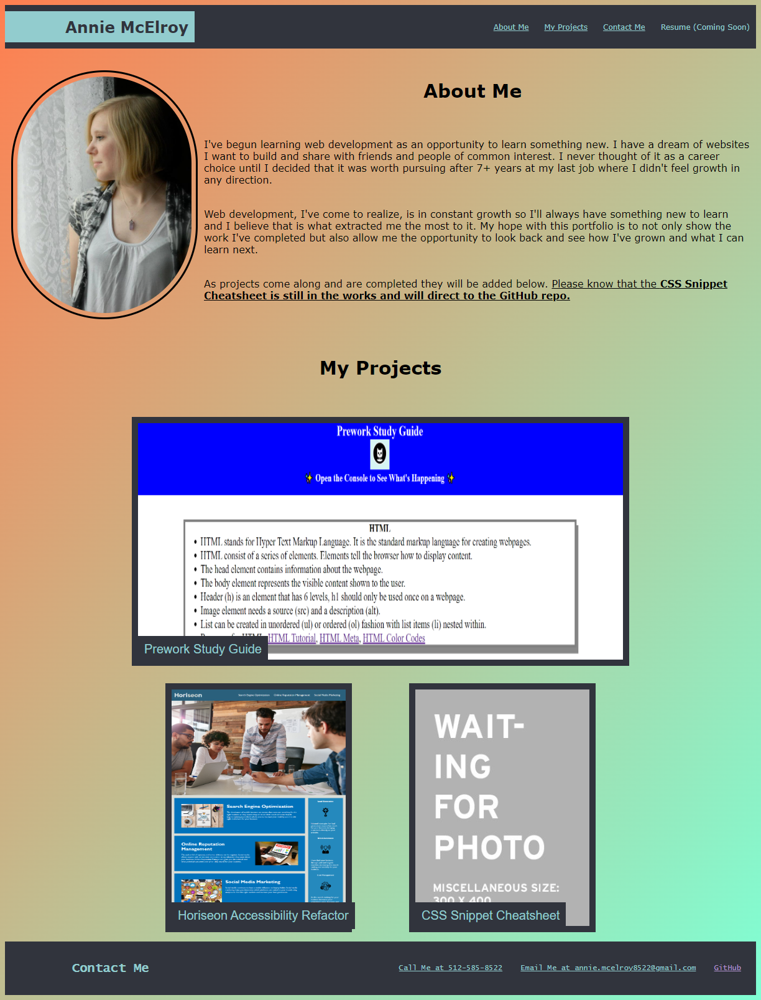

# Annie McElroy's Portfolio

## Description

A professional web development portfolio built from scratch with advanced CSS to demonstrate flexbox, media queries, and CSS variables. It includes a quick introduction about myself and highlights projects I have completed and that are currently ongoing to showcase my growing skills as time goes on.

### Task Completed
- Made a navigation menu that links to related sections in the page.
- Created an About Me section with am image of myself and a quick description about my interest in web development.
- Created a My Projects section to demonstrate current and ongoing projects
    - Screenshots of projects were created into buttons to direct to the deployed site or GitHub repo.
- Footer contains contact details for future employees
- Used flexbox and media query to present a responsive layout on smaller screens/windows

## Usage

Access the deployed portfolio here: [Annie McElroy's Portfolio](https://annie-mcelroy.github.io/annie-mcelroy-portfolio/)

## Credits

N/A

## License

MIT License

Copyright (c) 2023 Annie McElroy

Permission is hereby granted, free of charge, to any person obtaining a copy
of this software and associated documentation files (the "Software"), to deal
in the Software without restriction, including without limitation the rights
to use, copy, modify, merge, publish, distribute, sublicense, and/or sell
copies of the Software, and to permit persons to whom the Software is
furnished to do so, subject to the following conditions:

The above copyright notice and this permission notice shall be included in all
copies or substantial portions of the Software.

THE SOFTWARE IS PROVIDED "AS IS", WITHOUT WARRANTY OF ANY KIND, EXPRESS OR
IMPLIED, INCLUDING BUT NOT LIMITED TO THE WARRANTIES OF MERCHANTABILITY,
FITNESS FOR A PARTICULAR PURPOSE AND NONINFRINGEMENT. IN NO EVENT SHALL THE
AUTHORS OR COPYRIGHT HOLDERS BE LIABLE FOR ANY CLAIM, DAMAGES OR OTHER
LIABILITY, WHETHER IN AN ACTION OF CONTRACT, TORT OR OTHERWISE, ARISING FROM,
OUT OF OR IN CONNECTION WITH THE SOFTWARE OR THE USE OR OTHER DEALINGS IN THE
SOFTWARE.

---
